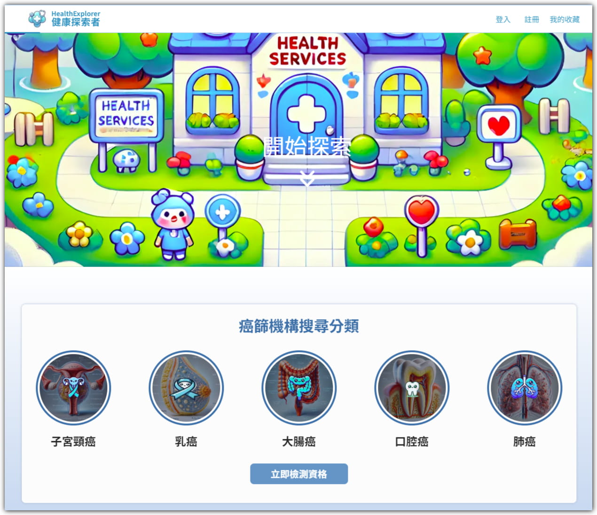
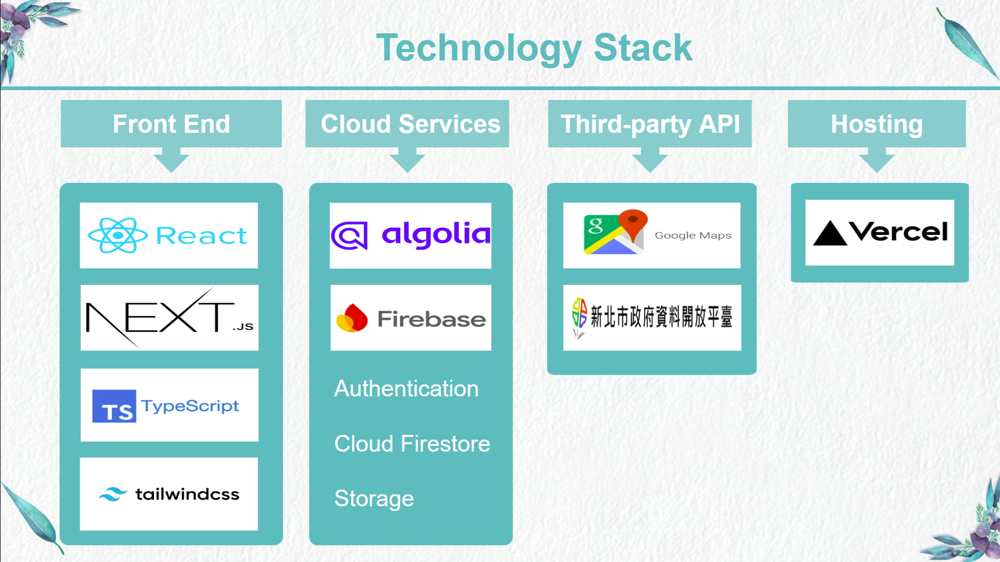
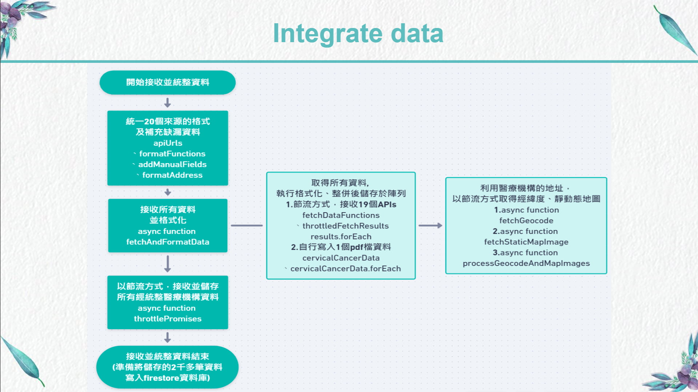
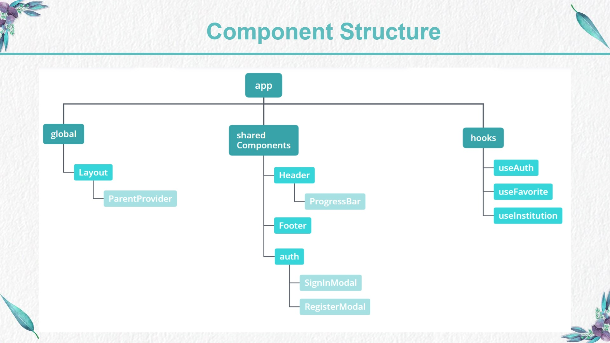
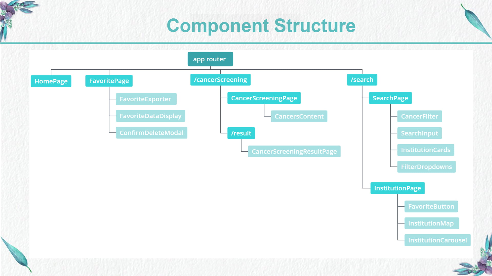

# Health Explorer (健康探索者)

**Health Explorer** is a website that provides flexible search capabilities for medical institutions across New Taipei City and facilitates eligibility checks for cancer screenings.

Website: <https://health-explorer-virid.vercel.app/>

- Test account : test1@healthExplorer.com 
- Test password : healthExplorer

# Technology Stack

## Frontend

- **React Hooks**：
  - useState
  - useRef
  - useCallback
  - useMemo
  - useEffect
  - useContext
  - useReducer
- **Custom Hooks**：

  - useAuth
  - useInstitution
  - useFavorite

- **Next.js**：App Router, static resources optimization
- **TypeScript**
- **Tailwind CSS**
- **AJAX**

## Cloud Services

- **Firebase**：

  - Authentication
  - Cloud Firestore
  - Storage

- **Algolia**：
  quickly conducts filter searches

## Third-party

- **Library**:

  - React Google Maps
  - React-pdf
  - Animate.css
  - AOS
  - React Spinners

- **APIs**:

  - NTPC Open Data: receives a list of 19 medical institutions from various divisions and cancer screening types.
  - Google Maps API: obtains the latitude and longitude of all medical institutions, along with static and dynamic maps.

    Due to the vast amount of data and format inconsistencies, data is integrated using multiple throttle functions to ensure no loss occurs.
    

## Others

- **Vercel**
- **ESLint**
- **Prettier**

## Component Structure

## Features

### HomePage:

### CancerScreeningPage:

### SearchPage:

### InstitutionPage:

### FavoritePage:

### RWD: 360 px ~ 1920 px

- **mobile**:

- **tablet**:

- **desktop**:

## Contact

- **Email**: shuyaHsieh318@gmail.com
- **Cake**: https://www.cake.me/funghi0983524367
- **Linkedin**: https://www.linkedin.com/in/%E6%B7%91%E9%9B%85-%E8%AC%9D-9906772b1/
